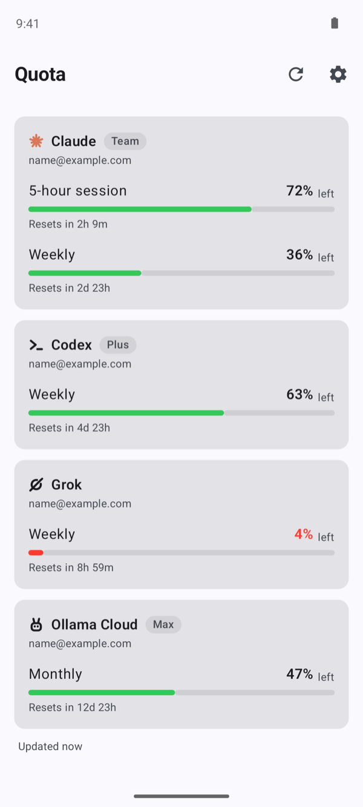
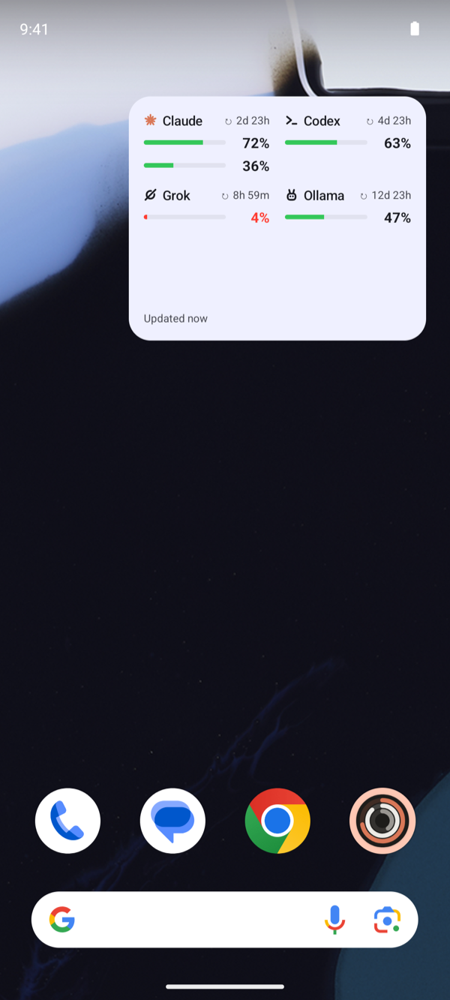

# Quota for Android

How much of your **Claude**, **Codex**, **Grok** and **Ollama Cloud** subscription limits you have left, on Android: an app plus a Home screen widget.

<p>
  
  
</p>

The Android companion of [Quota](https://github.com/turinglabsorg/quota), the macOS menu bar app. See also [Quota iOS](https://github.com/turinglabsorg/quota-ios) and [Quotax](https://github.com/turinglabsorg/quotax) for Linux.

## How it works

Your phone has no CLIs to read limits from, so an always-on Mac does it: [`quota-server`](https://github.com/turinglabsorg/quota#iphone-app-and-widgets) reads the accounts linked on that Mac every 5 minutes and publishes them over HTTPS. The app and the widget fetch those numbers with a device token. The phone never receives credentials for Claude, Codex, Grok or Ollama.

- **App**: every account with its windows (5-hour session, weekly, per-model weekly, monthly), bars and reset countdowns. Pull to refresh.
- **Widget**: small (four accounts) or medium (2 × 2 with reset countdowns), with the 5-hour session and the weekly window as two stacked bars, like the Mac menu bar. Refreshed every 15 minutes by WorkManager; it keeps the last numbers, with their age, when the server is unreachable.
- **Pairing**: run `quota-server pair` on the Mac and enter the single-use 8-digit code in the app. The token is encrypted with an Android Keystore key.
- **Languages**: English and Italian.

## Requirements

- Android 8.0 (API 26) or later
- A Mac running `quota-server` behind an HTTPS address (see [Quota](https://github.com/turinglabsorg/quota#iphone-app-and-widgets))
- To build: JDK 17 and the Android SDK (platform 34)

## Build and install

```bash
git clone https://github.com/turinglabsorg/quota-android.git
cd quota-android
./gradlew assembleDebug
adb install app/build/outputs/apk/debug/app-debug.apk
```

Open Quota, enter your server address and the pairing code, then add the widget from the app's settings or from the launcher's widget picker.

## Development

```bash
./gradlew testDebugUnitTest      # unit tests (payload parsing, windows, formatting)
./gradlew assembleDebug          # debug APK
adb shell am start -n com.turinglabs.quota/.ui.MainActivity --ez sample true   # sample accounts, for screenshots
```

Contributor notes for humans and coding agents are in [`AGENTS.md`](AGENTS.md); design notes in [`DESIGN.md`](DESIGN.md).

## Disclaimer

Quota is an independent project and is not affiliated with, endorsed by or sponsored by Anthropic, OpenAI, xAI or Ollama. Claude, Codex, Grok and Ollama are trademarks of their respective owners.

## License

[MIT](LICENSE)
